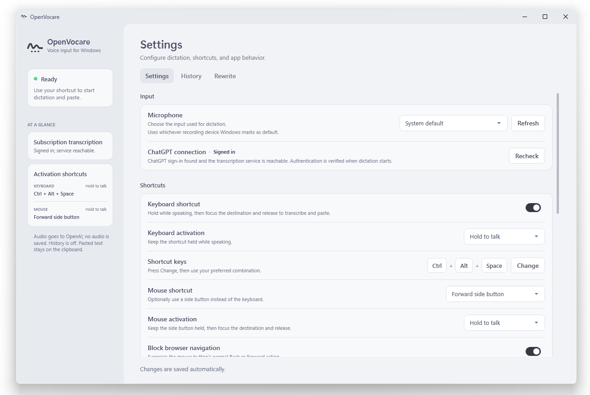

<p align="center">
  
</p>

<h1 align="center">OpenVocare</h1>

**System-wide Windows voice typing using the ChatGPT desktop sign-in you
already have.**

OpenVocare is a lightweight tray app that records from your chosen microphone,
transcribes through your existing ChatGPT desktop sign-in, and pastes the result
into the app you were using. No local speech model, API key, or additional
account is required.

> [!IMPORTANT]
> OpenVocare is an independent, unofficial open-source project. It is not
> affiliated with, endorsed by, or supported by OpenAI. It uses undocumented
> Codex/ChatGPT endpoints that may change without notice.

<p align="center">
  
</p>

## Why OpenVocare

- **Use your existing ChatGPT access** — no separate API billing or key.
- **Dictate anywhere** — editors, browsers, terminals, and messaging apps.
- **Low local overhead** — audio is recorded in memory; no speech model runs on
  your CPU or GPU.
- **Fast by default** — No rewrite pastes the transcript without a second model
  request.
- **Optional rewrites** — clean up, professionalize, restructure, translate, or
  apply a custom style before pasting.
- **No OpenVocare backend** — no additional account, analytics service,
  server-side saved audio, or server-side transcript logging.

## Features

- Configurable global keyboard and mouse shortcuts
- Hold-to-talk and press-to-toggle activation
- Destination capture when recording stops, so you can switch applications while
  speaking without letting network timing redirect the eventual paste
- Explicit microphone selection, including protection from virtual cables
  becoming the unintended input
- Safe clipboard delivery with password-field and elevation checks
- Optional previous-clipboard restoration after a successful automatic paste
- Escape-to-cancel
- Silent-input detection before upload and a configurable recording limit
- Optional local transcript history, disabled by default
- Error notifications by default, with optional successful-paste notifications
- Automatic settings persistence
- Start with Windows
- Single self-contained Windows executable

## Quick start

1. Install the ChatGPT desktop app and sign in to an account with Codex access.
2. Download and run `OpenVocare.exe`.
3. In **Settings**, select your microphone and confirm that the ChatGPT
   connection is ready.
4. Hold `Ctrl+Alt+Space` and speak. You may switch applications while recording.
5. Focus the destination text field and release the shortcut to lock that
   destination, transcribe, and paste.

The shortcut, activation style, mouse button, and rewrite mode are all
configurable. The recording safety limit defaults to two minutes and can be set
to 1, 2, 5, 10, or 30 minutes. Longer recordings use more memory and take
longer to upload and transcribe. Press `Escape` while recording to cancel.

## Rewrite modes

| Mode | What it does |
|---|---|
| No rewrite | Pastes the transcription exactly as returned. Fastest option. |
| Minimal cleanup | Fixes obvious speech artifacts while preserving wording and meaning. |
| Professional | Produces clear, polite professional prose without changing technical meaning. |
| Ramble to clear thoughts | Organizes spoken brainstorming into coherent, structured writing. |
| Translate | Faithfully translates into the selected language. |
| Custom | Applies a locally saved instruction profile for your preferred tone or format. |

Rewrites are optional and add a second subscription-backed request. If rewriting
is unavailable, OpenVocare safely delivers the original transcript.

OpenVocare currently requests `gpt-5.6-luna` with **low reasoning effort** for
rewrites, prioritizing responsiveness while the rewrite prompts and structured
output protect the original meaning. This model identifier is an implementation
detail of the unofficial ChatGPT desktop integration—not a stable public API
contract—and may change as ChatGPT or Codex evolves.

## Latency benchmark

A controlled paired test compared OpenVocare with the official ChatGPT desktop
`Ctrl+M` dictation shortcut on the same Windows machine. Both paths received the
same repeated five-second English recording through the same virtual
microphone. Two independent sessions used discarded warm-ups, 20 measured pairs
in total, alternating AB/BA order, and No rewrite mode.

| Metric | ChatGPT desktop `Ctrl+M` | OpenVocare |
|---|---:|---:|
| Correct pastes | 20/20 | 20/20 |
| Mean latency | 4,300.3 ms | **3,628.9 ms** |
| Median latency | 4,263.6 ms | **3,402.9 ms** |
| P95 latency | 5,324.2 ms | **4,115.0 ms** |

OpenVocare was faster by **671.5 ms on average** across the two sessions and won
17 of 20 paired trials. The measured boundary was shortcut release to matching
text appearing in the editor. The paired 95% confidence interval was
approximately 19.6 to 1,323.4 ms in favor of OpenVocare.

This is evidence from one machine, network, recording, and test date
(2026-07-27), not a universal performance guarantee. All valid samples,
including a 1,220.9 ms official result and a 7,416.8 ms OpenVocare result, were
retained. The full methodology and raw samples are in
[`docs/benchmarks/2026-07-27-paired-latency.md`](docs/benchmarks/2026-07-27-paired-latency.md).

## Privacy and safety

- Microphone audio is held in memory and discarded after success, failure, or
  cancellation.
- Audio is sent to OpenAI for transcription. Rewrite text is sent only when a
  rewrite mode is selected.
- OpenVocare has no operator-owned backend, analytics service, account system, or
  telemetry collector.
- Access tokens are read locally from the current ChatGPT desktop sign-in,
  cached only in process memory, and never copied to settings or logs.
- Tokens, audio, transcript text, request bodies, and response bodies are not
  written to diagnostic logs.
- Optional transcript history is stored only on this device and is disabled by
  default.
- Automatic paste is blocked for password fields and unsafe
  unelevated-to-elevated boundaries.
- If pasting is unsafe or fails, the transcript remains available on the
  clipboard.
- Previous-clipboard restoration is disabled by default. When enabled, it runs
  only after a successful automatic paste and never overwrites a newer clipboard
  change.

## How it works

1. `WindowsAudioRecorder` captures WAV audio into an in-memory stream.
2. `DirectCodexTranscriptionClient` reads the local ChatGPT/Codex
   authentication and sends the recording to the subscription-backed
   transcription endpoint.
3. An optional rewrite request transforms the transcript with persistence
   disabled.
4. `TextInjectionService` validates the destination captured when recording
   stops, updates the clipboard, and injects paste without sending `Enter`.

OpenVocare does not open or manipulate the ChatGPT desktop composer and has no
Desktop UI-automation fallback.

## Requirements

- Windows 11 x64
- A microphone allowed for desktop apps
- The ChatGPT desktop app, signed in to an account with Codex access

Building from source additionally requires the .NET 10 SDK.

## Build from source

```powershell
dotnet test .\OpenVocare.sln -c Release
.\build.ps1
```

The build produces:

```text
artifacts\publish\win-x64\OpenVocare.exe
artifacts\OpenVocare-portable-win-x64.zip
```

## Local data

```text
%LOCALAPPDATA%\OpenVocare\
  settings.json
  history.json
  logs\
```

`history.json` is created only after history is enabled and a transcript is
successfully delivered.

## Attribution

Endpoint research was informed by
[`Wangnov/codex-asr`](https://github.com/Wangnov/codex-asr). See
[third-party notices](./THIRD_PARTY_NOTICES.md).

Codex, ChatGPT, OpenAI, and related marks belong to their respective owner.

## License

OpenVocare is available under the [MIT License](LICENSE).
